本文介绍的是一种全自动的，具有语义感知能力的API fuzz harness合成技术，这个技术模仿人工生成harness的试错过程，但是这个过程在这种技术中完全以fuzzing的过程来自动化完成。

作者利用API头文件来变异拼接各个候选的harness，并通过一组正确性oracle来来评估这个harness的有效性：这个oracle就包含编译、执行、以及覆盖率上的变化。

# INTRODUCTION

大多数库中的具体API语义除了开发者之外无人知晓，这对harness的生成造成了很大的困难。当前自动生成harness的方法大多都按照“学习”库中的语义来保证生成harness的正确。这种学习方法大多是静态地从已有可用的对于目标库中API的引用中得来的（比如从单元测试、具体应用或者是其他的harness）

那么可想而知的是，在缺乏这些可用引用的前提下，这种“学习”的方法效果就会变差。

后面又提出了一种叫做Hopper的动态harness生成策略，通过变异API调用以及数据来实现实时的harness生成，但是这种方法会造成一些关键的API语义被破坏（参数顺序，调用顺序，数据初始化等）

这个自动生成harness的核心操作是像fuzz一样分别变异并fuzz一批harness，然后用一组正确性预言机过滤掉那些语义无效的harness。OGHarn生成harness所需要的只有库的头文件。

# BACKGROUND, RELATED WORK, AND MOTIVATION

对于库API的测试需要使用的到harness，也就是对目标API的一个wrapper，然而撰写harness并非易事。正确的调用API需要保证语义上的正确（也就是开发者在编写这些API时所建立的规则，比如函数的调用顺序、参数的个数、参数的类型等）。如果不能保证语义正确的话就会出现前面说到的由于语义错误导致的crash，这种crash没有任何意义。这样就会导致一个问题：：只有库的开发者或者有相应知识的人员来编写一个可用的harness。

当前的harness生成技术一般分为静态生成和动态实时生成。静态生成的依赖与从各种来源（使用目标库的项目、目标库的单元测试、其他的harness）来提取相关的语义知识。动态实时生成的方法会利用API的运行时反馈，来将备选的API以及数据拼接到一起。

作者的研究就是为了克服在动态harness生成之中遇到的由于语义错误引起的高概率的假阳性crash的问题。当前最先进的Hopper在生成harness时有高达64%的假阳性率。

Hopper作为一个**不依赖参考实现或形式**的动态harness生成方法，在围绕库API的初始化、数据与参数、调用顺序这三个方面有三个主要的问题：

初始化错误：作者举了一个initGEOS库下的例子来说明：在某些库的调用中需要先初始化某些对象才能进行后面的操作。比如这里就是没有对errorhandler函数的回调函数做正确的初始化引发的假阳性问题

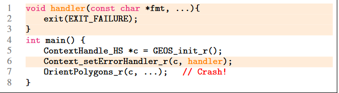

数据与参数的错误：还是这个库，在某些情况下，再调用某个API前需要对传入给它的某些参数进行校验，缺失了这个校验有可能会导致假阳性崩溃，这里缺失了对于x的非空检查从而导致了崩溃：

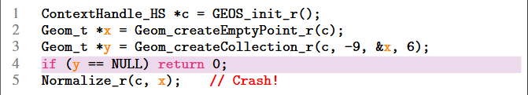

调用顺序错误：有些API需要遵循一定的调用顺序才能正确使用，还是在这个库中：一个已经被释放了内存的对象是不能被再次释放的，并且也有可能导致在某些对象的使用还没结束时就被释放（premature cleanup）

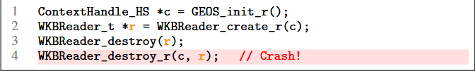

# ORACLE-GUIDED AUTOMATED HARNESSING

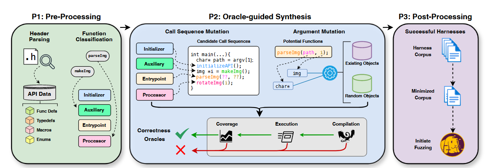

这个OGHarn主要由三个步骤组成：

1. 预处理
2. 合成
3. 后期处理

## Library Header Pre-Processing

OGHarn是一个与Hopper一样的不依赖参考实现或形式（reference- and specificationagnostic）的harness生成方法。在这里实现的基础就是对于库的头文件的解析，完成对函数，类型以及API相关对象的精准定位。

作者使用了现成的C语言解析API来分析头文件以获得名称，类型，以及宏定义，enums，typede，函数以及函数指针的值。

同时，这里作者给函数类型分为了以下四类：

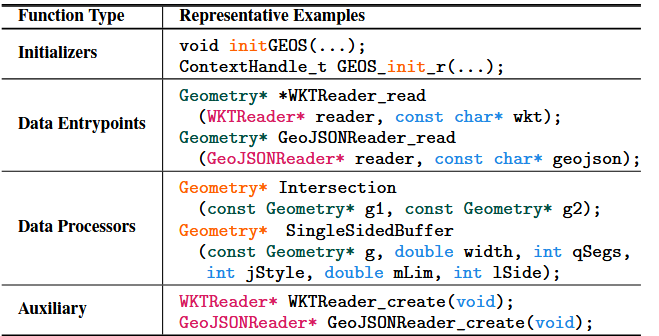

初始化类型：将名称中包含init这个字符串的函数划分为初始化类型

数据入口点类型：将fuzz数据实际读入内存并转化为库中API所需要的对象的函数

数据处理类型：在完成数据传入以及对应对象生成过后，可能会进行一些对对应对象进行的操作

辅助类型：很多时候，API函数也需要一些特定的参数，比如IO上下文，错误/消息处理句柄等需要库提供的一个固定的routine来完成。与数据入口点和数据处理不同，这个类型只是为了解决API中所需要的某些参数的问题，所以它不作为fuzz测试的对象。

总的来说，这一部分就是建模了一个较为常见的库函数调用流程：

初始化->传入数据->数据处理->其他必要参数的准备->调用被测API

## Oracle-guided Synthesis

这个部分是通过一组预言机来完成对于无效harness的过滤。作者的这组预言机比较常规：编译、执行、代码覆盖率。

### Mutating Call Sequences

由于前面已经对从头文件中提取到的函数信息完成了分类，并对调用过程完成了建模。所以这里harness的构建过程就是：初始化->传入数据->数据处理

对于调用顺序的编译主要采取的变异策略为：

1. 初始化的插入：按照建模，harness最开始的操作应该是初始化函数的调用，所以这里会至少插入一个初始化函数在harness的开头
2. 选择数据入口点：优先从那些将内存区域指针或者字符串指针作为参数的数据入口点类型的函数中选取一个，如果没有找到的话，则放宽标准从哪些使用到void指针的函数中选择
3. fuzz输入的加载：根据数据入口点函数的不同需要采取不同的方法将fuzzer产生的模糊测试数据输入到harness中，如果数据入口点函数以文件路径作为输入，作者将这个参数设置为argv[1]（比如AFL会将含有模糊测试输入的文件路径作为参数），如果数据入口点将数据流作为输入，那么就插入一个文件IO操作将含有模糊测试输入文件的内容读入对应的缓冲区中。
4. 插入数据处理：在完成数据入口点的设置后，就会添加数据处理类型的函数，每添加一个处理类型，就会重启变异来尝试包含更多的数据处理类型进去。根据作者统计，包含2-4个是最好的。
5. 最终状态检查：为了更进一步的避免假阳性的问题，这里作者在harness中引入对于API返回值的校验，对于那些有返回值的API函数，如果是布尔类型就判断它是不是为true，是指针类型就判断他是否为空，是数值类型就判断它是否超过了常见的一些表示错误的返回值（0,-1）

### Mutating Arguments

在完成API调用的拼接之后就需要解决harness所需要的数据依赖

1. 函数指针：对于有些需要函数指针作为参数的函数，作者使用dummy stubs来填充，一旦调用这个dummy stubs，则程序直接退出，防止假阳性
2. 数据对象：对于需要一些数据对象作为传入参数的API，首先考虑从前面返回了的目标对象作为参数。比如，已有某个函数返回了一个 `Geometry*`，那就把它传给下一个需要 `Geometry*` 参数的函数；（对象复用）。如果没有现成的对象可用，则考虑调用一些辅助初始化函数（auxiliary function）来“造一个”；或者直接创建一个新的结构体对象（比如声明 `Geometry geom;` 并初始化）（主动构建）。如果都不行，则重新执行一次调用顺序变异来使harness可以处于前面两种状态中的一种
3. 类字符串对象：对于类似于文件路径的对象，则则尝试各种可能的路径值（如 `/tmp/ABC123`）；对于类似文件权限标志，则使用常见权限字符串（如 `"r"`、`"w"`）；对于可写入的缓冲区（即非 const 指针），则构造一个新初始化的同类型对象用于传参
4. 类数据对象：插入一些现有的较为特殊的数字（0、1、-1、64），或是与缓冲区相邻的整数参数的sizeof

### Validating Mutations via Correctness Oracles

 这个部分就是用一组预言机来判断生成的harness是否是有效的。

1. 编译：看编译是否通过
2. 执行：将事先准备好的一些在该库下正常或是畸形的数据通过编译好的harness执行，另外，与sanitizer相结合来看harness的执行是否报错
3. 代码覆盖率：检测在非崩溃的情况下哪些待选harness会因为API调用不当而导致覆盖率停滞。作者对（1）正常与畸形的输入（2）正常与正常比较；按照直觉来说，API对于较为畸形的（或者说不合法）输入会退出的更早，触发较低的代码覆盖，而正常的输入应该会触发较高的代码覆盖率。而对于都是正常的输入来说，如果该API在都是正常输入的情况下也产生差异较大的覆盖率，那么说明这个API是输入敏感，这种harness就更有价值。

### Learning Call and Data Dependencies

当某个 harness 变异因未通过一个或多个 **Oracle（正确性判据）** 而被丢弃时，系统不会就此停下，而是会**回退并重新执行变异**，尝试寻找更合适的：

- 函数调用（call）；
- 或参数（argument）；

即：它具有“错误回溯”和“重试优化”的机制。

只有当一个harness能够通过所有的预言机检测后才能被保留

# IMPLEMENTATION

Parsing Implementation：使用一个叫做CXXHeaderParser的python库进行解析，会返回一个json格式的dump文件

Mutation Implementation：OGHARN 在内部使用基于图的中间表示（IR）来管理 harness 的构造与变异流程，这种设计使得添加新的函数或参数变异器变得非常方便。目前系统为每个目标 API 函数设定了最多 128 次的变异次数上限，该数值可根据需求灵活调整。

Validation Implementation：使用一个叫做cfile的python库来完成IR到C代码的转换，并使用fuzzer提供的编译器进行编译（附带需要的sanitizer），代码覆盖率则有AFL++的afl-showmap来获取

主要支持基于C语言的库API

# EVALUATION

## experiment setup

主要与Hopper以及OSS-fuzz中人工编写的harness做对比。以AFL++作为fuzzer。

测试对象选择了20个现实世界较为流行的库，其中有4个当前没有可用的 harness（以此来测试这个工具在面对没有可用harness时的harness生成能力）

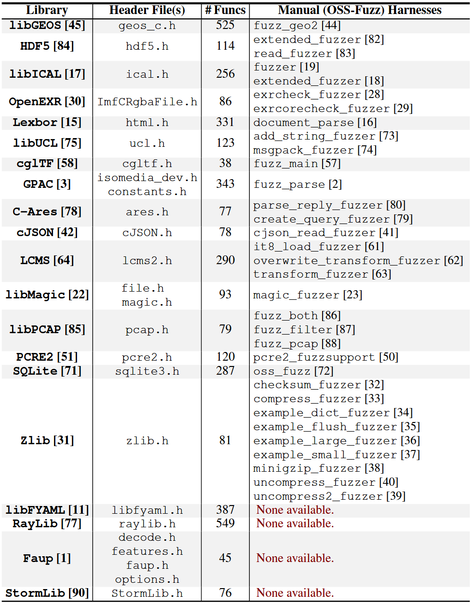

## Q1：Semantic Correctness

过量的crashes与过早地达到覆盖率极限是语法上无效以及目标API误用的一个较为明显的标志，所以这里判断harness是否是语义上正确的判据作者就采用这个标准。

对于每个目标库生成最多120个harness并对其进行每个5x1hour的fuzz测试，根据两个标准：

1. 是否频繁崩溃：如果某个harness的输入之中，有超过10%会造成crash
2. 覆盖率停滞：如果在前半阶段或后半阶段出现了明显的覆盖率停滞

对前面筛选出的这些可能异常的harness作者结合API手册进行对应分析，判断是否是真的语义无效的harness。

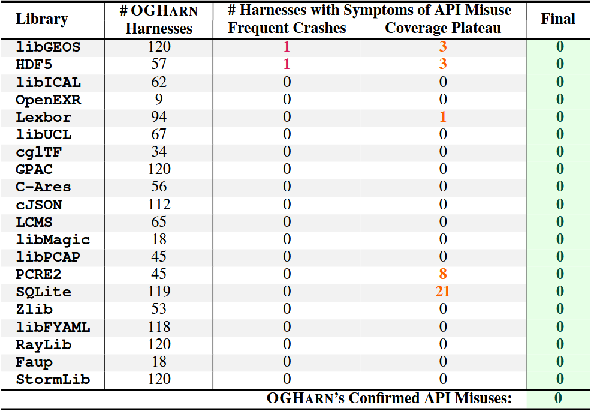

图里面出现的几个疑似异常的harness后续被作者结合文档证明是这些API本身的特性而非生成的harness有问题。

## Q2：Depth in Library Coverage

这个实验是为了证明这个工具可以在生成harness时包含更多独特的API进去进行测试，作者与人工编写的harness进行对比，总体上在函数覆盖上提升了653%

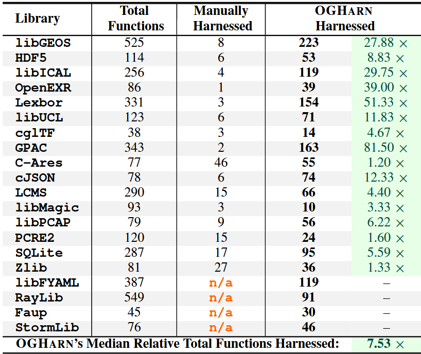

数据上几乎是碾压人工编写。

能够覆盖更多函数并不一定代表能在覆盖率上表现的更好，为了评估 OGHARN 的运行时覆盖率表现，作者将其与 Hopper 及 OSS-Fuzz 中人工编写的 harness 进行对比。实验采用 AFL-QEMU-Cov 对各个库的 top-10 harness 进行五轮 fuzzing，并分析其基本块覆盖率。结果显示，OGHARN 的总覆盖率中位数为 Hopper 的 0.69×，但对比人工 harness 达到 1.14×，且在独特覆盖率上更具优势，达 4.64×。特别是在函数较多的大型库中，OGHARN 能成功生成高质量 harness，而 Hopper 在多个案例中因约束恢复失败而无法构建有效测试。

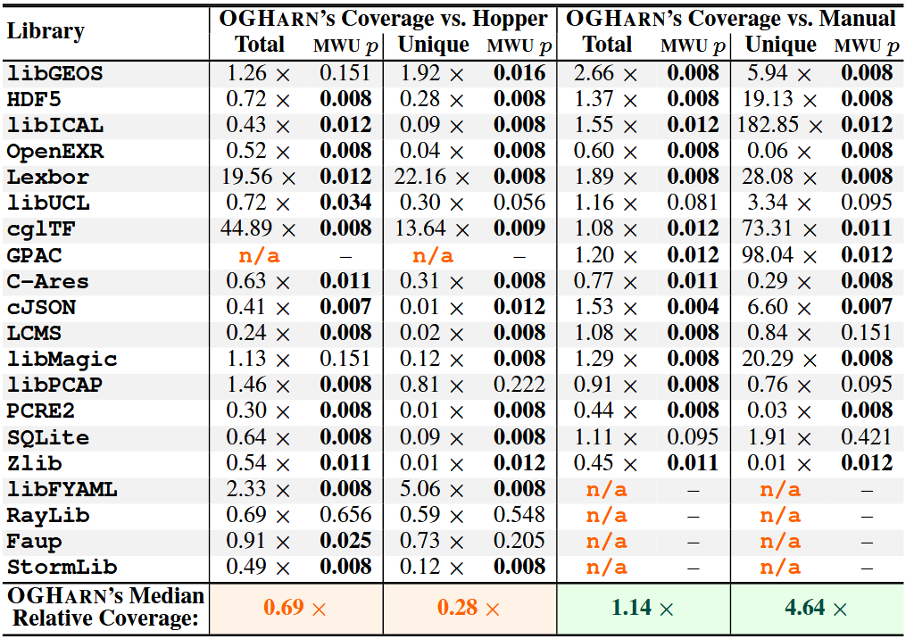

## Q3：Vulnerability Discovery

这个实验就是为验证这个工具生成的harness是否可以帮助fuzzer找到更多的漏洞

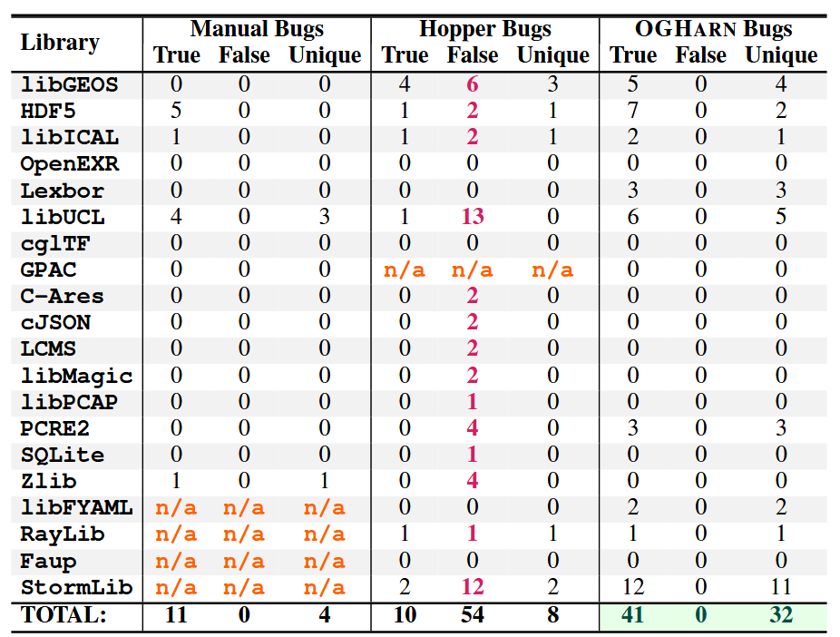

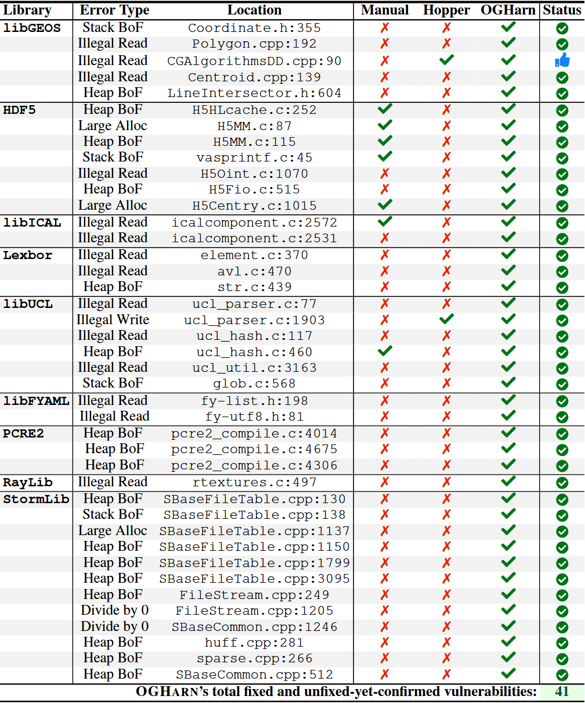

数据表现上还是很好的。

