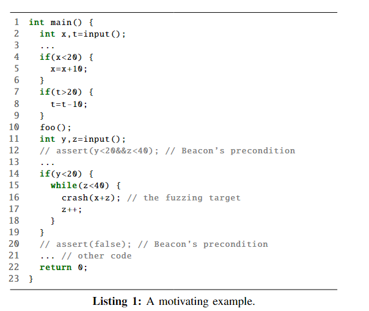
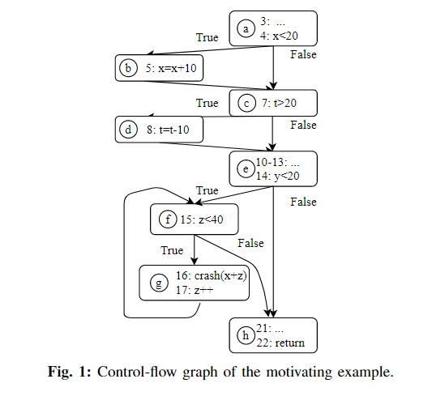
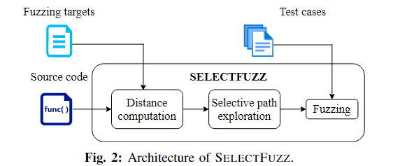
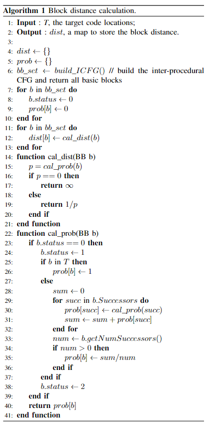
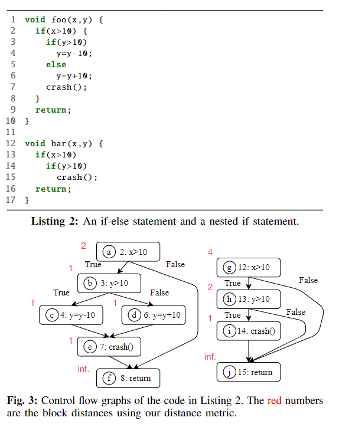
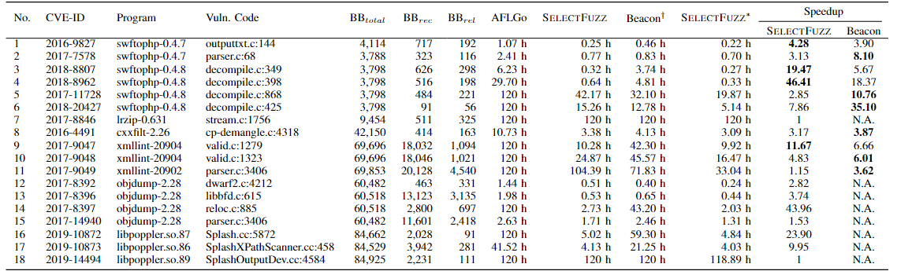
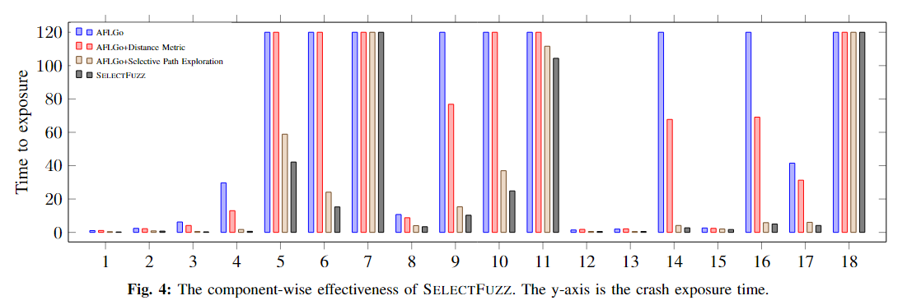
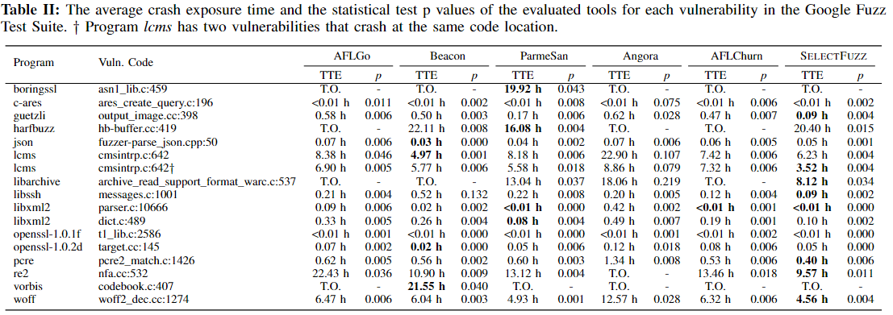
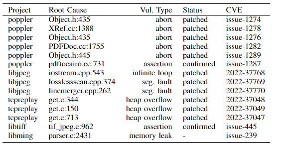

# introduction

现在定向fuzz主要面对的两个问题：

1. 如何识别定向fuzzer应该去探索的相关代码
2. 如何将不相关的代码从项目中去除

对于以第一个问题：通过分析目标代码的控制条件（control-flow conditions）以及数据依赖（data-flow conditions）将能满足特定的控制流和特定数据流的代码视为相关代码

对于第二个问题：通过选择性的插桩来排除无关的代码，也就是只插桩前面判断的有关代码

selectfuzz的大概步骤：

1. 首先静态的识别与目标相关的代码（前面提到的两个条件），提出了一个新的距离指标来推断某个代码块是否可以到达目标
2. 然后对相关代码进行覆盖率以及距离反馈插桩

本文的四个贡献：

1. 提出了相关无关代码的一个新概念，并展示了他对定向模糊测试的重要性
2. 提出了一种新的定向fuzzer，通过选择性的路径探索来提升效率
3. SELECTFUZZ表现很好，并且可以与beacon互补
4. 发现了14个新的漏洞

# background 

提升定向模糊测试的两个方向：

1. 通过符号执行或污点追踪等方式获得高质量输入
2. 识别出可以反馈给fuzzer的interesting的输入（哪些输入是值得继续探索的）

总的来说，主要的问题就是如何识别或者说如何衡量一个输入它是否是对fuzz有意义的（也就是interesting的）。以前的定向模糊测试通过两种方式来识别输入是否有趣：

1. 基于序列的输入优先次序：AFLGo提出的一种metric：是在cfg里面用dj算法算距离（两个基本块之间的距离），输入距离就是到目标访问块之间所有基本块的平均距离
2. 输入可达性分析：现在这个方式主要有两种方法：
   1. 深度学习
   2. 路径修剪

第一种方式不会提升定向测试的效率且不能保证有效性

第二种方式会浪费大量的energy在一些可以到达但是与目标无关的代码测试上

# PROBLEM STATEMENT

## relevant code：



比如说在这张图中，其实只有14-15行是对触发crash有影响的，前面的2-10都不会直接影响crash触发。也就是说，满足这些判断条件并不能对到达目标位置产生影响，只会浪费energy。但是也不能直接完全的将对于到达目标无关的部分直接归于无关代码，比如5行中对于x的操作，可能会影响crash的exploitation阶段，所以也要将line 5视为相关代码

## Limitations of Existing Approaches

主要问题还是前面提到的浪费了太多energy在探索无关代码，通过上面的listing 1举了个例子：



假如种子的执行路径为a->c->e->h，通过种子产生的一批输入M中有一个输入N触发了f或者b，而且其他的输入虽然触发了其他的块，但是由于这些块与最后的目标无关，所以都可以被归为无意义的输入。

现在的fuzzer会浪费时间对这些无意义，但是有可达性的输入进行变异，浪费energy

## Research Goals and Challenges

本文主要就是要设计一种新的路径探索策略来规避前面提到的这种对无关路径的探索。

主要面对两个挑战：

1. 首先，虽然可以确定说程序中确实存在这样的无关代码，但是考虑到现实中程序的各种复杂状态，这种有关无关是很难被自动且精确地定义的
2. 然后，如何去避免探索这些无关代码也是一个挑战

# SELECTFUZZ



selectfuzz引入了一种新的距离评估标准（distance metric），并采用了一种过程间控制流以及数据流分析来识别并选择性的插桩

## Distance Metric

本文提出的这种指标是用来表示一个基本块到目标位置的多路径到达“可能性”（multipath reaching "probability"）

跟以前的那些反映某个输入到目标的输入距离指标相比，它有这么几个优点：

1. 通过考虑一个基本块到目标位置所有的路径综合的估计了其到达目标代码的可能性
2. 它通过过程间控制流分析以及目标调用分析准确的衡量了跨函数之间的距离

### Block Distance



为基本块设置了三个状态：

- 0：初始化
- 1：正在计算
- 2：完成计算

Pb:到达的可能性，展示了从基本块b到达目标T的可能性（cal_prob），然后将这个Pb的倒数作为某个基本块到目标位置的距离（cal_dist）

关键是这个**cal_prob**：

如果这个基本块b就在目标代码T里，那这个Pb就被设为100%，否则就递归地从这个b的后继块中计算这个可能性，这个Pb就是所有这些后继块可能性的平均值。

不考虑条件表达式的复杂性，并假设条件表达式的每个分支都可以以同样的概率到达。这种简化是必需的，因为真实概率取决于逻辑表达式和相应的输入。

对于这个真实概率，可以利用符号执行之类的技术来近似估计，但是由于符号执行也需要输入的实际概率分布来估测这个真实概率，所以作者将其视为future work

在真实的项目中存在大量的循环和递归，这里的处理方式是将循环只进行一次Pb计算

对于跨函数的距离计算，本文将被call函数所属的block作为调用call block的successor

### Input Distance

输入的输入距离是其运行中涉及的所有基本块的最短块距离。 描述执行与目标位置相隔多远

### An Example



节点a有两个successor，其Pa=(Pb+Pf)/2=0.5,所以d(a,T)=1/Pb=2（其实就是从crash那里反着推回来，以e的Pe=1作为基点，例如c只有e一个successor，所以Pc=Pe/1）

Ph=(Pi+Pj)/2=1/2,Pg=(Ph+Pj)/2=1/4

然后假设有这样两个输入S1 S2，它们分别对应：a->f,g->j（比如想x>10），在AFLGo的输入距离测算下（这里我也不太了解AFLGo的输入距离测算方式，我大概猜测是通过到达crash位置的边数量来决定的），dinput(S1, T )=3，dinput(S2, T )=2，所以AFLGo会分配更多的energy给S2，但是其实通过观察这个CFG可以看出来，要满足S2触发的crash的条件是要更多的，所以其实分配更多energy给S1进行变异是更好的。

所以在本文的么metric计算方式下：dinput(S1, T ) = dbb(a, T ) = 2 dinput(S2, T ) =dbb(g, T )= 4。这样就会选择S1分配更多energy

## Selective Path Exploration

本文是选择性插桩并只探索与目标位置的相关代码

### Relevant Code Identification

将与目标位置有控制或数据依赖的代码作为相关代码

定义了两种相关代码：路径分歧代码（path-divergent）和数据依赖代码（data-dependent）

这里的path-divergent就是一条可达路径和一条不可达路径的最后一个交汇的块，比如上图中的这个h块就应该是一个path-divergent code

data-dependent是指在其他块代码中影响目标中会用到的关键变量的值

path-divergent会为fuzzer提供正反馈，因为如果某个输入能够到达这个path-divergent code的块，那么说明它与目标之间是可达的（非无限的距离），那么fuzzer就可以通过这些能到达的输入继续进行变异，虽然过程中可能会产生只能到达不相关代码块的输入，但是由于对这些代码块不会进行插桩，所以fuzzer不会去收集这些块的反馈信息，所以fuzzer就不会将这些输入作为interesting的

对间接影响path-divergent的code也是不插桩的，比如前面list 1中的第14 15行代码的判断可能会受13行中省略的某些代码的影响。但是由于它对作为path-divergent code 的是间接影响，所以也不插桩。这些代码在到达path-divergent的过程中就一定会被探索到，但是对这些代码进行插桩不会对fuzz提供什么有用的反馈，只会增加运行时开销

对于data-dependent code，这一部分可能在对于漏洞的触发上有帮助，即某些漏洞有可能只有在某些数据满足特定条件下才会触发，所以关注这一部分代码可以为fuzzer的利用阶段提供帮助

当前的fuzzer不支持（但是可以）路径修剪，这一部分作者留作了discussion

考虑前面的figure 1，根据文章的定义，基本块b  e  f  g就是所谓的相关代码块，其中e f是path-divergent code，b g是data-dependent code

### Input Prioritization

fuzzer会选择那些可以覆盖到更多相关代码的输入，但是有可能某一次并没有产生能够满足某个关键条件的输入，此时fuzzer就会去选择变异那些虽然是不相关但是有更小输入距离的输入

### Power Scheduling

fuzzer沿用了AFLGo的模拟退火的方法。将更多的energy分配给那些离目标位置更近的输入（更小的输入距离），其中，未被插桩的代码不参与输入距离计算

# IMPLEMENTATION

## Call Graph

构建调用图时运用了points-to analysis的方法，并运用了基于参数类型和基于地址的修剪，可以在保留所有正确边的情况下消去70%的边。现在这个fuzzer只支持C程序

## Inter-procedural Data-flow Analysis

使用了backward inter-procedural data-flow analysis。首先识别出目标位置上的关键变量，并找到影响这些变量的代码。为了支持跨过程分析，SELECTFUZZ 会分析每个调用点（call site）的被调用函数（callee function），并识别关键变量依赖的数据的参数/参数变量（arguments/parameters）。接着，它分析被调用函数内的数据流关系，以推断其返回值是否与关键变量存在数据依赖关系。最后，SELECTFUZZ 将被调用函数的返回值传播到正确的调用点，并以上下文敏感的方式进行处理

## Alias Analysis

本文并没有解决conservative points-to analysis的固有问题，也就是误报的问题。比如在某些情况下，分析工具会认为两个指针指向同一个内存位置，从而认为他们之间存在数据依赖关系，例如：

```
int a, b;
int *p1 = &a, *p2 = &b;
```

## Execution Timeout

fuzzer对于输入执行的超时设计还是在超过设定的时限后会减少分配给对应输入的energy，但是并不会直接将超时的输入丢弃，因为他们可能虽然超时了，但是仍能探索到新的相关代码。

# EVALUATION

• RQ1 How effective is SELECTFUZZ in triggering known vulnerabilities?

• RQ2 How does each component of SELECTFUZZ contribute to its performance?

• RQ3 Which factors affect SELECTFUZZ's effectiveness?

• RQ4 How does SELECTFUZZ perform in a standard fuzzing benchmark?

• RQ5 Can SELECTFUZZ detect new vulnerabilities in realworld programs?

## Triggering Known Vulnerabilities

采用同样的种子，5次120小时

BBtotal、BBrec 和 BBrel 分别表示程序中基本块的总数、可达基本块的数量和相关基本块的数量，Beacon†表示我们对Beacon原生的路径修剪实现，SELECTFUZZ∗ 表示 SELECTFUZZ 和 Beacon† 的集成



由于beacon没有开源也没有公开种子语料库，作者是直接重用的beacon作者论文里的数据

这个实验就反映了选择性路径探索和路径修剪确实可以提升fuzz的效率，并且这两种方式是互补的

## Ablation Study



## Understanding Performance Boost

### Instrumentation Overhead

前面相关块与总基本块数的数量对比反映了一个问题就是真正意义上需要插桩的部分其实很少，尽量只对需要插桩的部分插桩可以大幅减少运行时开销

### Exploring Relevant Code

在探索过程中探索到的无关代码与有关代码会的这个比值反映了fuzz的效率，当前的定向fuzzer的这个比值较大通常就反映了较低的效率

### Seed Inputs

输入种子的质量也会很大程度上的影响fuzz的效率

### Complexity of Path Constraints

到达目标位置的路径约束的复杂性也会影响fuzz的效率，当前的fuzzer偏向于一些路径约束更加“简单”的输入，而这可能会导致fuzzer去变异那些路径约束较为简单但是只能探索到一些无关代码的输入

## Benchmarking

使用Google Fuzzer Test Suite (GFTS)



selectfuzz不能再另外几个case中超过其他几个fuzzer的主要原因是因为它不能产生高质量的输入来满足复杂的路径约束。而selectfuzz可以兼容这些先进fuzzer用到的诸如路劲裁剪等技术来互补。

## Detecting New Vulnerabilities



# CONCLUSION

面临的三个问题：

1. False Positives in Relevant Code Identification（作者考虑用其他更先进的静态分析技术）
2. Solving Complex Path Constraints.（这是现在fuzz面对的一个常见的挑战，作者考虑融合其他的技术比如污点追踪，结构敏感的变异）
3. Identifying Vulnerable Code Paths.（并不是所有的可达路径都是vulnerable的，现在的fuzzer有可能去探索一些具有可达性但是却是安全的路径）

做出的提升：

1. 采用了一种新的距离度量，可以准确地测量不同程序路径和输入的到达概率
2. 与 AFLGo 相比，它实现了高达 46.41× 的加速
3. 检测和报告了现实世界程序中 14 个新漏洞