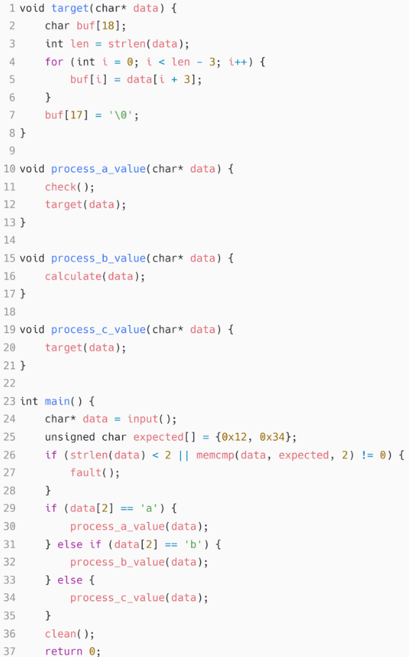

# Highlights

- 精准距离计算方法：提出了一种可以通过识别基于静态分析可到达目标位置的程序路径的精确距离计算方法，可以有效的减少参与到距离计算的基本块数量并以此提高计算的精准度
- 定向变异方法：提出了一种基于污点分析对基本块中与程序输入处理相关的字节进行对应变异的方法。这种方法可以在fuzz的过程中对产生偏差的路径进行纠偏。解决了在定向fuzz中依赖随机变异的问题。
- 实际表现：触发程序崩溃的速度更快，与AFLGo, Beacon, WindRanger, and SelectFuzz这几个定向fuzzer相比都有明显提高，并且可以触发4个别的fuzzer不能触发的漏洞。

# Introduction

定向fuzz的一个核心要素的就是通过静态分析的手段结合一套距离指标给基本块设置了到达目标位置的距离，这个距离会被用于后续的fuzz种子选择上面（也就是选择离目标位置更近的种子进行后续变异）

现在的定向fuzzer存在一些缺点：

1. 首先在计算距离时其目标是整个代码空间，在AFLGO中对于每个函数间（未找到实际路径的函数间距离）的距离设定为10，这就使其无法区别一些长短种子
2. 当前的定向fuzzer虽然是基于距离引导的，但是在实际的fuzz进程中依赖的fuzz方法仍然是随机fuzz，这会导致其生成的很多的输入是无法正确到达目标位置的

根据以上两点，本文的核心工作就是两点：

1. 收缩距离计算的目标大小，不在对整个代码空间中的所有基本块和函数进行距离的计算（排除无关代码）
2. 根据分析发现每个基本块会对输入中的不同固定偏移上的字节进行处理，那么通过变异这些对应的字节就有可能把程序在偏移基本块处产生的执行偏差进行纠偏

当前定向fuzz基本都基于AFLGO来进行改进，对于AFLGO之中的距离计算法方式虽然都进行了一定的改进，但是其基础逻辑任然是使用固定值来计算函数间的距离（也就是AFLGO之中的那个跳转倍率）。

本文中提到的一个发现是： 每个基本块只对输入中的固定偏移上的一些字节进行处理，所以当程序的执行流在一些偏移基本块发生偏移时，通过变异与这些偏移基本块相关位置上的比特位有可能可以将程序的执行流纠正过来。

在实现上，首先提取出目标项目的CG和CFG，并从中分析出程序入口点到目标位置的所有路径，结合静态分析的前后向分析找到所有与目标位置有关的所有函数或基本块。这些函数或基本块就是后面距离计算和插桩的对象（以此滤除无关的代码）。而前面提到的与基本块相关的比特位置以具体的偏移基本块是哪个则是依靠污点分析来完成，这些位置则是后面进行定向变异时所需要的信息。

# Backgroud and Motivation

在aflgo之中，对于距离的计算是将函数间的距离（也就是CG中的一条边，表示一次函数间的跳转）的cost设定为了一个固定值10（这里等于说是AFLGO将每个函数间跳转所需要经过的基本块数量都设置为了10个），然而在每个函数内部，所含有的基本块不一定是相同的，所以直接使用一个固定的cost显然是不准确的。

在上面这个例子中，从main函数到target总共是有两条路径：

main → process_a_value → check → target

main → process_c_value → target

在AFLGO的计算方式中，路径1的距离是23，而路径2的距离是13，所以AFLGO会给路径2分配更多的能量。但是如果在实际上，process_c_value 函数在执行时可能执行了20个基本块，而process_a_value 与check 可能各自只执行了5个基本块，那么实际上路径1的实际距离是13而路径2的实际距离是23。

克服这个问题的关键就是要将函数间距离的计算转化为执行函数时实际执行的基本块数量，但是要进行这种精度的距离计算就会带来较大的时间开销。