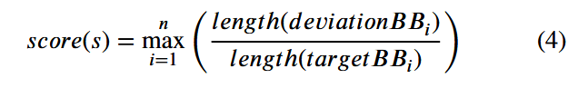

# Highlights

- 精准距离计算方法：提出了一种可以通过识别基于静态分析可到达目标位置的程序路径的精确距离计算方法，可以有效的减少参与到距离计算的基本块数量并以此提高计算的精准度
- 定向变异方法：提出了一种基于污点分析对基本块中与程序输入处理相关的字节进行对应变异的方法。这种方法可以在fuzz的过程中对产生偏差的路径进行纠偏。解决了在定向fuzz中依赖随机变异的问题。
- 实际表现：触发程序崩溃的速度更快，与AFLGo, Beacon, WindRanger, and SelectFuzz这几个定向fuzzer相比都有明显提高，并且可以触发4个别的fuzzer不能触发的漏洞。

# Introduction

定向fuzz的一个核心要素的就是通过静态分析的手段结合一套距离指标给基本块设置了到达目标位置的距离，这个距离会被用于后续的fuzz种子选择上面（也就是选择离目标位置更近的种子进行后续变异）

现在的定向fuzzer存在一些缺点：

1. 首先在计算距离时其目标是整个代码空间，在AFLGO中对于每个函数间（未找到实际路径的函数间距离）的距离设定为10，这就使其无法区别一些长短种子
2. 当前的定向fuzzer虽然是基于距离引导的，但是在实际的fuzz进程中依赖的fuzz方法仍然是随机fuzz，这会导致其生成的很多的输入是无法正确到达目标位置的

根据以上两点，本文的核心工作就是两点：

1. 收缩距离计算的目标大小，不在对整个代码空间中的所有基本块和函数进行距离的计算（排除无关代码）
2. 根据分析发现每个基本块会对输入中的不同固定偏移上的字节进行处理，那么通过变异这些对应的字节就有可能把程序在偏移基本块处产生的执行偏差进行纠偏

当前定向fuzz基本都基于AFLGO来进行改进，对于AFLGO之中的距离计算法方式虽然都进行了一定的改进，但是其基础逻辑任然是使用固定值来计算函数间的距离（也就是AFLGO之中的那个跳转倍率）。

本文中提到的一个发现是： 每个基本块只对输入中的固定偏移上的一些字节进行处理，所以当程序的执行流在一些偏移基本块发生偏移时，通过变异与这些偏移基本块相关位置上的比特位有可能可以将程序的执行流纠正过来。

在实现上，首先提取出目标项目的CG和CFG，并从中分析出程序入口点到目标位置的所有路径，结合静态分析的前后向分析找到所有与目标位置有关的所有函数或基本块。这些函数或基本块就是后面距离计算和插桩的对象（以此滤除无关的代码）。而前面提到的与基本块相关的比特位置以具体的偏移基本块是哪个则是依靠污点分析来完成，这些位置则是后面进行定向变异时所需要的信息。

# Backgroud and Motivation

## distance calculation

在aflgo之中，对于距离的计算是将函数间的距离（也就是CG中的一条边，表示一次函数间的跳转）的cost设定为了一个固定值10（这里等于说是AFLGO将每个函数间跳转所需要经过的基本块数量都设置为了10个），然而在每个函数内部，所含有的基本块不一定是相同的，所以直接使用一个固定的cost显然是不准确的。

在上面这个例子中，从main函数到target总共是有两条路径：

main → process_a_value → check → target

main → process_c_value → target

在AFLGO的计算方式中，路径1的距离是23，而路径2的距离是13，所以AFLGO会给路径2分配更多的能量。但是如果在实际上，process_c_value 函数在执行时可能执行了20个基本块，而process_a_value 与check 可能各自只执行了5个基本块，那么实际上路径1的实际距离是13而路径2的实际距离是23。

克服这个问题的关键就是要将函数间距离的计算转化为执行函数时实际执行的基本块数量，但是要进行这种精度的距离计算就会带来较大的时间开销。

在其它的研究中也有不少对于这个问题的解决方式：

Hawkeye在AFLGO对于距离测算的单指标体系中引入了一个新的指标：路径相似度，Hawkeye会在静态分析阶段收集程序入口点到目标位置的路径中所包含的函数信息，并以此来判断各个种子除距离外的路径相似度。

windranger则关注到了那些执行了更多基本块并最终停止在距离目标位置更近的种子可能会比那些执行了更少的基本块并最终停在了距离目标位置较远地方的种子具有更高的距离值（这里表达的意思是，这个距离目标更近的种子应该更值得变异，然而其在执行逻辑上更高的距离值让其并没有分配到更高的能量）。由此其引出了偏移基本块的概念，它会获取在种子执行中所过路径中偏移基本块，并通过到达偏移基本块的复杂性来调整计算出的距离值。

当前对于基于距离计算的定向fuzz都在解决距离计算精度的问题。主要的挑战就是找到一种方法解决用固定值表示函数间距离的问题并将时间开销最小化。

**本文对于这个函数间距离的解决方法是将函数内入口点基本块与产生函数调用基本块间的距离视作函数间的实际距离。**

## seed generation

现在的fuzzer大多采取随机生成的方式来产生fuzz输入，这会导致输入到程序中的大部分输入都是无意义且不能到达目标位置的，只会浪费资源。

当前的对于这个问题的解决方法是通过识别无关的代码或路径来提前终止这些无意义输入的执行。

beacon通过后向区间分析来选择性的插入断言，以此来提前终止一些不能达到目标位置的输入。

sievefuzz则是首先来判断目标位置在出事的ICFG（程序间控制流图）中是否存在能够到达目标位置的路径，如果不存在，那么它会进入一种探索性的状态，来找到那些非直接的调用信息并以此来更新ICFG；只要当他找到一条可以到达目标位置的路径，它就会开始实际的fuzz进程。

这些方法都过于依赖静态分析，并且没有解决根本的问题：随机生成会造成大量无意义输入的产生。

# Method

## overview

主要是两个阶段：静态分析阶段和fuzz loop阶段

静态分析阶段会抽取程序的CG和CFG，找到从程序入口点到目标位置的所有可达路径，并在此之上进行有路径约束的距离计算，完成选择性的插桩。

fuzz loop阶段则会使用动态污点分析技术来找到输入字节中受偏移基本块控制的部分，污点分析的结果会被用于后续的定向变异。

## Path-Constrained Distance Calculation

这里的相关代码指的是与到达目标位置存在控制关系的部分，也就是可达路径中包含的部分。这里没有考虑数据流关系，因为数据流关系虽然对触发相关漏洞有影响，但是对到达目标位置是没有实际影响的，所以在这里不考虑。

具体的算法为：

首先从ICFG中抽取出程序入口点到目标位置的路径，然后对这个路径上的每个函数做后向的分析，找到所有这些函数所依赖的函数。然后再通过分析获得会被这些函数所调用的函数，把这些后续分析得到的函数都加入到插桩的范围内。之后就对入口点到目标位置的路径进行解析后获得基本块上的路径吗然后对其进行距离计算。

在静态分析的过程中，推断出循环和递归的迭代次数是一个很大的挑战，本文采取的是一种传统的方式，只对其展开一次（也就是把这些当成是一般的代码只执行一次），另外，对于静态分析汇总非直接调用造成的调用关系缺失问题，本文采用的也是一种传统的方式：Andersen’s points-to analysis，并结合使用基于参数类型和基于地址的剪裁来对图中的边进行一些修改，一般可以在保留正确边的情况下去除掉70%的边。

在具体的距离计算中，将函数间的距离定义为函数入口点到调用下一个函数的基本块间的距离，某个函数在一个函数中可能被多次调用，这个距离就把按前面计算方式得到的距离取一个平均值：

对于总体的距离计算是按照下面这个公式：

也就是在当前函数中到下一个跳转点的距离+到达该函数之前所经过的路径中的函数间距离+目标函数中入口点到目标基本块间的距离（一个固定值）

**这里还将一个所谓的种子距离定义为了偏移基本块到所有目标基本块的目标基本块距离的平均值（什么意思？）**

tips：猜测应该是给初始种子赋的距离值？

这里deviateBB代表第一个从到目标位置路径上产生偏移的基本块。

## Byte-directed Mutation Path Correction

基于DataFlowSanitizer（LLVM DFSan）来实现污点分析。DFSan将程序的所有内存中的字节映射到一个大的shadow memory中，并记录污点标记。每个字节在对应一个污点标记，并以此来表示它的状态（是否被污染）。但是DFSan只能反映字节是否被污染，不能显示出它在相关输入中的偏移。

本文创建了一个表来存储这个污点标记对应的相关输入中的字节偏移信息。偏移信息被表示为一个比特向量，每个比特i就对应输入中第i个字节。这个比特向量会被作为一列插入到一张表中：

按照这张图来理解的话：

如果输入包含五个字节，那么对应的污点记录表中每个bit向量就是五位，每个与这个输入产生了交互的变量都对应了一个bit向量。

这里x使用到了输入的的第一个字节，那么他在表中的记录就是[1,0,0,0,0] 同理，y用到了第二到第四个字节，那么就对应[0,1,1,1,0] 而在污点分析的角度上，x,y,z这些变量会有一个污点索引，将这个索引和表中的行号形成映射就可以把每个变量的所涉及到的输入中的相关部分字节关联起来。

污点分析的具体算法：

主体就是要对每个基本块变量检查是否受到污染。

最后，汇总提取的基本区块和输入字节之间的关系，将经常在同一基本区块中一起处理的连续字节（一段offset）识别为字段。也就是将基本块与输入字节联系起来，方便后面根据基本块位置进行的定点变异

对于具体的变异实施：

首先获得testcase的具体执行路径。然后找到最深的那个偏移点（距离目标位置最近）也就是这个while循环做的事，得到的这个rate就是深度的一种体现。然后将找到的这个偏移基本块是否有对应的通过前面污点分析找到的输入的部分字节，如果没有对应，就随机挑选一个偏移和字段来赋给这个对应的偏移基本块。

结合前面获得这个偏移和字段的信息对输入进行定向变异。

由于字节级别的污点分析开销相当大，所以不会每次执行都进行一次污点分析，只会在执行到一些新的与目标位置相关的区域时才会再次进行污点分析。

在种子的分数计算中采取：

length是指从入口点到该基本块的路径长度，这个得分体现路径能到达的位置离目标基本块有多近，以此来给那些离的较近的种子分配更多的能量。

*tips：这个得分是运行时的得分，前面个距离是静态分析时的得分*

同时通过概率控制来控制是否使用随机变异：

这个就是看前面得到的分数高不高，如果分数高（使用随机变异的概率越小），说明离目标较近，适合利用定向变异来到达目标位置。如果较远，那么就大概率使用随机变异来展开更大的探索空间。

在基于字段的大小选取不同的变异策略，如果是大于两字节，那么就选用一些固定变异格式，小于两字节则尝试穷举变异。

另外如果已经到达目标位置，则尝试触发漏洞。对所有执行路径中，特别是目标基本块对输入中的偏移和字段有关系的字节进行精确的确定性变异，对那些没有用到的部分做非确定性变异。